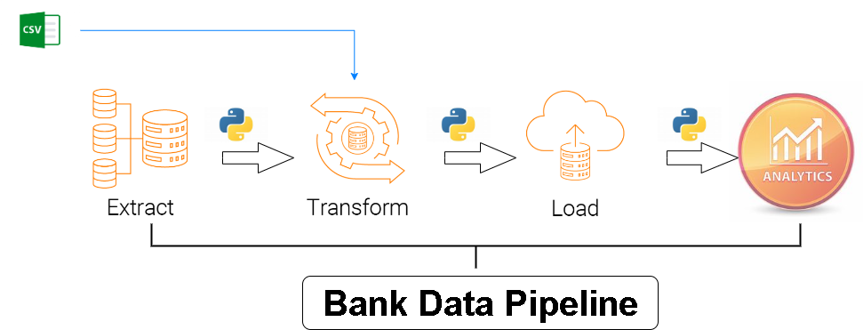

# Bank Data Pipeline
## Acquiring and processing information on world's largest banks

## Project Overview
The Bank Data Pipeline is an ETL (Extract, Transform, Load) project designed to acquire, process, and analyze data about the world's largest banks. The project involves web scraping, transforming data into various currencies, and storing it in both CSV and database formats. The aim is to facilitate analysis and insights by running queries on the processed data.

## Key Features
- Data Extraction: Scrapes the latest bank data from a live website.
- Data Transformation: Converts bank market capitalization data into multiple currencies (USD, GBP, EUR, INR).
- Data Loading: Saves the final processed data to CSV files and databases for further use.
- SQL Query Execution: Runs database queries to extract meaningful insights.
- Logging: Tracks each stage of the ETL process for easy debugging and process monitoring.

## Project Structure
- Logging: Functions to log each significant step in the ETL process.
- Data Extraction: Extracts data from a specified URL using web scraping techniques.
- Data Transformation: Transforms data by adding currency conversions.
- Data Loading: Loads the transformed data into both CSV and database formats.
- SQL Queries: Provides functionality to run and retrieve results from SQL queries on the data.

## Dataset
The project uses live data scraped from a web page that lists the largest banks by market capitalization. Exchange rates for currency conversion are provided in an external CSV file.

## Technology Stack
- Python: Primary programming language used for data extraction, transformation, and loading.
- BeautifulSoup: For web scraping and parsing HTML content.
- Pandas: For data manipulation and transformation.
- SQLite: For storing data in a relational database.
- Requests: For making HTTP requests and fetching web data.
- Icecream: For improved logging and debugging.

## How to Run the Project
1. Clone the repository to your local machine.
2. Ensure all required libraries are installed using `pip install -r requirements.txt`.
3. Modify file paths if necessary (e.g., CSV file, database file).
4. Run the main Python script to execute the entire ETL pipeline.
5. Review the log file for progress updates and any potential issues.

## Future Enhancements
- Automate the data extraction process to run periodically and update the dataset.
- Expand the data sources to include additional financial metrics.
- Integrate more advanced transformation functions to enhance data analysis capabilities.
